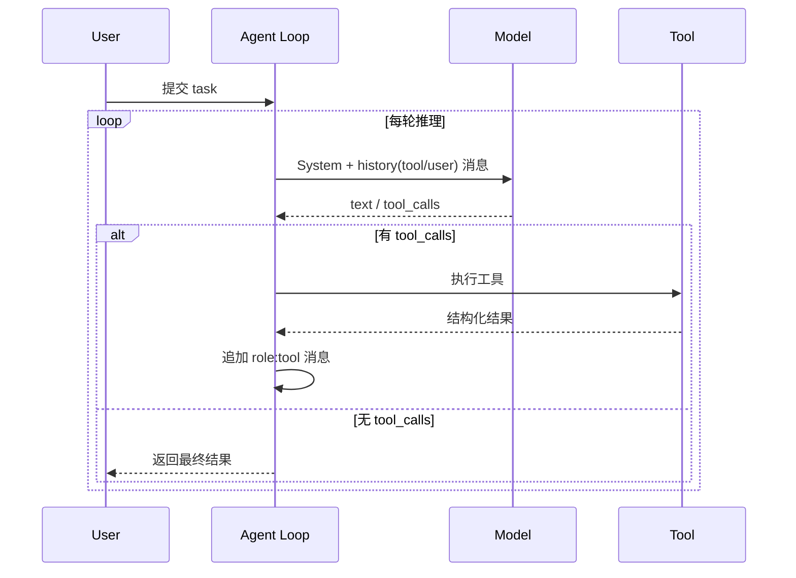

# Agent Loop

## 是什么
Agent Loop 是 Agent 持续「感知环境 → 模型推理 → 调用 Tool 改变环境」的驱动核心，把单次 LLM 补全扩展成可多步推进的自治过程。

## 怎么做
主流实现基于 ReAct（Reason+Act）范式，落地为 function-calling loop：每轮把 System / 历史 Tool / User 消息拼成上下文发给模型，模型可返回文本或 tool_calls，运行时执行工具后把结果作为 `role: tool` 消息回填，进入下一轮，直到模型不再请求工具或触发终止条件。

关键设计：System 消息在整轮循环中恒定不变；Tool 结果以 `tool_call_id` 与请求对齐；User 消息仅首轮或中途注入。

## 为什么
没有显式 Loop，模型只能一次性作答，无法处理需多步检索、迭代或环境反馈的任务；但 Loop 本身不保证收敛，需配合后文 max_steps 与预算护栏（见 /01-agent-basics/budget-control）。

## 常见误区
- 把 Tool 结果当作 User 消息回填，破坏 `tool_call_id` 对齐，导致多轮调用后模型上下文错乱。
- 每轮都重发完整 System + 全量历史，未做 Context Window 裁剪，长任务极易溢出（见 /03-context-memory/context-window）。

## 业界实现对照
- OpenAI Agents SDK：Runner.run 内部即 `model → tools → append → repeat` 循环，直至无输出。https://openai.github.io/openai-agents-python/
- LangGraph：以 StateGraph 节点显式表达 loop，支持条件边与中断恢复。https://langchain-ai.github.io/langgraph/

## 延伸阅读
- /01-agent-basics/tool-abstraction
- /01-agent-basics/structured-output
- /01-agent-basics/budget-control
- /03-context-memory/context-window

---
*最后核实日期：2026-08-26*
