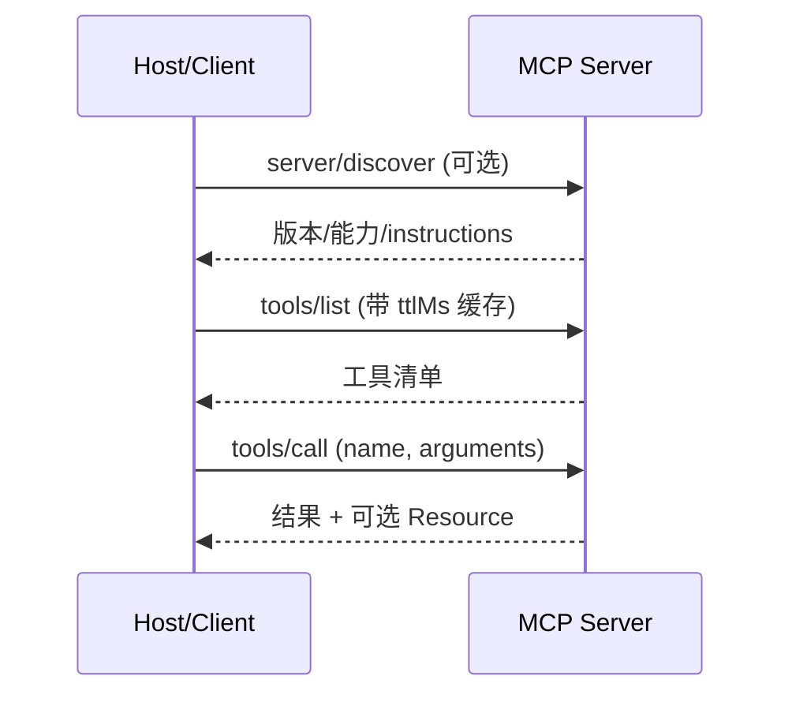

# MCP（Model Context Protocol）

## 是什么
MCP 是基于 JSON-RPC 2.0 的开放协议，标准化 Host 应用与工具/数据源之间的通信。它把「Function Calling 的厂商绑定」替换为可发现、可协商、可跨供应商复用的 Agent-Tool 接入层。当前规范版本为 **2026-07-28**。

## 怎么做
**架构**：Host（AI 应用，管理权限/上下文，每连接一个 Server 创建一个 Client）持有若干 MCP Client；每个 Client 对接一个 MCP Server（暴露 Tools/Resources/Prompts）。

**三种原语**：

| 原语 | 语义 | 类比 |
| --- | --- | --- |
| Tools | 模型可执行的带 schema 函数 | Agent 的手 |
| Resources | 可读数据（URI + MIME） | Agent 的眼 |
| Prompts | 可复用提示模板 | Agent 的 SOP |

**Transport**：`stdio`（子进程，本机默认、零网络开销）与 `Streamable HTTP`（单一 `/mcp` 端点，POST+GET，可选 SSE，无状态、多客户端）。旧版 HTTP+SSE 已弃用。2026-07-28 起协议核心无状态——移除 `initialize` 握手与 `Mcp-Session-Id`，每请求在 `_meta` 自带版本/身份/能力，`server/discover` 为可选能力发现 RPC。

**动态连接生命周期**：本地 stdio 由 Host spawn 子进程即连即用；远程 Streamable HTTP 走 OAuth 2.1 授权发现 → 客户端注册（CIMD 优先，DCR 已弃用）→ 令牌交换 → 调用。`tools/list` 等结果带 `ttlMs`/`cacheScope`，客户端可缓存目录。

## 为什么
不引入 MCP，工具定义强耦合于模型厂商的 Function Calling schema，切换 provider 需重写定义，且每次请求都烧掉 Context Window 承载工具清单。MCP 把发现与执行标准化，让一个 Server 被任意 Host 复用。

## 业界实现对照
- **官方 TypeScript / Python SDK**：`modelcontextprotocol/typescript-sdk`、`modelcontextprotocol/python-sdk`，均对齐 2026-07-28。
- **Claude Agent SDK / OpenAI Agents SDK**：通过 MCP client 把外部 Server 的 Tools 接入各自 Agent Loop。

## 延伸阅读
- [/01-agent-basics/tool-abstraction](/01-agent-basics/tool-abstraction)
- [/02-capability-extension/multi-agent](/02-capability-extension/multi-agent)
- [/02-capability-extension/skill-management](/02-capability-extension/skill-management)
- 官方规范：https://modelcontextprotocol.io/specification/2026-07-28/

---
*最后核实日期：2026-08-26*
