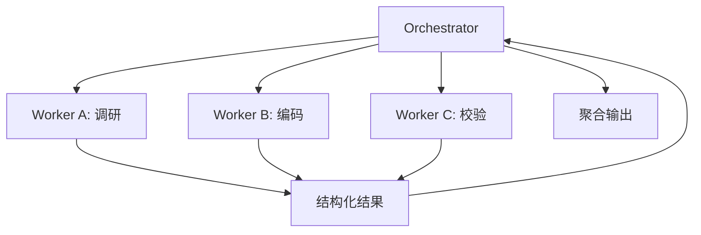

# 多 Agent 协作

## 是什么
多 Agent 协作解决单 Agent 在长任务上面临的 Context Window 膨胀与注意力退化：把复杂目标拆给多个专职子 Agent 并行处理，再由编排者聚合结果。

## 怎么做
**Orchestrator-Worker**：Orchestrator 负责任务分解、派发与结果聚合；Worker 各自独立运行 Agent Loop，只回传结构化结论。



**任务拆分与聚合**：子任务描述须自包含（目标 + 输入 + 产出 schema），Orchestrator 用统一 schema 合并，避免自由文本拼接丢失结构。

**上下文隔离取舍**：Worker 隔离后互不污染上下文、可并行，但共享状态需显式传递（如 MCP 的 handle 模式），否则跨 Worker 信息无法流转；隔离也意味着重复加载公共知识，有 token 成本。

**A2A（Agent-to-Agent）**：跨 Agent 的任务委派协议，约定委派消息与结果格式。注意它解决的是 *Agent 间* 通信，与 MCP 的 *Agent-Tool* 通信正交：

| 维度 | A2A | MCP |
| --- | --- | --- |
| 通信双方 | Agent ↔ Agent | Agent ↔ Tool/Server |
| 解决的问题 | 任务委派、能力寻址 | 工具发现与执行 |
| 结果形态 | 任务级结构化交付物 | Tool 调用返回值 |
| 典型传输 | HTTP / 消息队列 | stdio / Streamable HTTP |

A2A 委派最小约定：

```json
{ "task_id": "t-1", "delegator": "orch",
  "worker": "coder", "input": { "spec": "..." },
  "output_schema": "{patch, tests}" }
```

## 为什么
不拆分，长任务会让单 Agent 上下文被中间过程淹没，错误率随长度上升；但过度拆分会引入聚合与传递开销，需在隔离收益与协调成本间权衡。

## 业界实现对照
- **LangGraph**：用 `Send` / subgraph 实现 Orchestrator-Worker 与状态共享。
- **OpenAI Agents SDK**：通过 handoff 把对话委派给子 Agent。
- **MCP**：Worker 内部仍经 MCP 接入工具（见 [/02-capability-extension/mcp](/02-capability-extension/mcp)）。

## 延伸阅读
- [/04-planning-execution/todo-management](/04-planning-execution/todo-management)
- [/02-capability-extension/mcp](/02-capability-extension/mcp)
- [/03-context-memory/context-window](/03-context-memory/context-window)
- [/03-context-memory/session-state](/03-context-memory/session-state)

---
*最后核实日期：2026-08-26*
