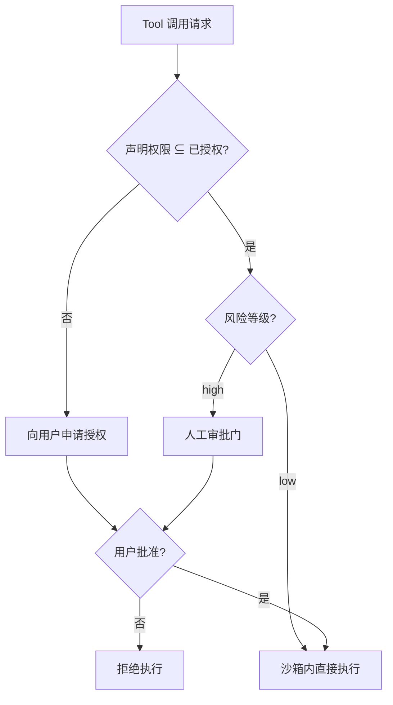

# 权限与沙箱

## 是什么
权限与沙箱解决的是 Tool 的「破坏半径」问题：Agent 自主调用外部能力时，必须限定其能做什么、在什么环境做、以及哪些操作必须人工确认。

## 怎么做
**最小权限原则**：每个 Tool 只声明完成任务所必需的能力，默认全拒（`deny-by-default`），按白名单放行。

**工具级权限声明**：在 Tool 元信息中显式标注所需 scope，宿主据此向用户索取授权，而非一次性放开全部。

```yaml
tools:
  - name: fs_write
    permissions:
      - "files:write:/workspace/*"   # 仅限工作区
    risk: high
    require_approval: true
  - name: http_get
    permissions:
      - "net:outbound"
    risk: low
```

**执行环境隔离**：高风险 Tool 在容器或独立进程中运行，限制文件系统挂载、网络与 syscall；宿主通过 MCP / stdio 与之通信，不直接共享进程空间。

**人工审批门**：对 `risk: high` 或写操作，在 Agent Loop 中插入确认节点，用户放行后才真正执行。



## 为什么
不做隔离与审批门，一个 Prompt Injection 即可诱导 Agent 删库、外发数据或横向移动。最小权限把单点失陷的爆炸半径压到单个 scope。

## 常见误区
- 用「信任模型输出」代替权限检查——模型会被注入，权限必须机器强制。
- 沙箱只封网络不封文件系统，仍可被读密。

## 业界实现对照
- **Claude Agent SDK**：per-tool 权限与交互式审批。
- **LangGraph**：用 `interrupt` + 权限节点实现 human-in-the-loop。
- **MCP 授权**：远程 Server 走 OAuth 2.1 scope 约束（见 [/02-capability-extension/mcp](/02-capability-extension/mcp)）。

## 延伸阅读
- [/02-capability-extension/mcp](/02-capability-extension/mcp)
- [/05-safety-governance/guardrails](/05-safety-governance/guardrails)
- [/05-safety-governance/kill-switch](/05-safety-governance/kill-switch)
- [/01-agent-basics/tool-abstraction](/01-agent-basics/tool-abstraction)

---
*最后核实日期：2026-08-26*
