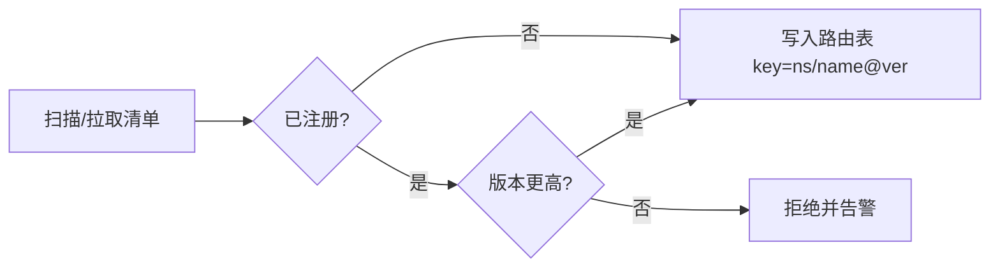

# Skill 管理

## 是什么
Skill 是「提示词 + 工具 + 运行时约束」的打包单元，让 Agent 在运行时按需挂载领域能力。Skill 管理的核心问题是：如何在成百上千个 Skill 中低成本地发现、加载并避免冲突。

## 怎么做
**发现（Discovery）**有两种主流路径：

| 发现方式 | 机制 | 适用场景 |
| --- | --- | --- |
| 文件系统扫描 | 遍历 `skills/` 目录，按 `SKILL.md` 元信息注册 | 单仓库、本地 Agent |
| 中心化 Registry | 向 registry 拉取清单并缓存 | 多团队、需权限分级 |

**加载策略**决定冷启动开销与 Context Window 占用：

```text
预加载：启动时全部载入元信息 → 发现快，但元信息膨胀、占 token
懒加载：仅载入名称/描述索引，命中后才读全文 → 省 token，首次调用多一次 IO
```

最小实现：索引期只把 `name` + `description` 注入 system prompt，真正触发时才读取 Skill 正文与绑定的 Tool。

**命名空间与版本冲突**：当不同来源的 Skill 同名时，用 `namespace/skill@version` 作为唯一键。加载器在解析时按 `(namespace, name, version)` 建立路由表，冲突项拒绝注册并告警，而非静默覆盖。



## 为什么
不做命名空间隔离，跨团队共享 Skill 时同名覆盖会静默改变行为，故障难以溯源；不区分懒/预加载，元信息堆积会挤占 Context Window，抬高延迟与成本。

## 常见误区
- 把 Skill 描述写得太泛，导致 Agent 选错技能（描述即提示词）。
- 用版本号做隐式覆盖，破坏可复现性。

## 业界实现对照
- **Claude Agent SDK**：以 `SKILL.md` frontmatter 声明 `name`/`description`，运行时自动发现。
- **LangChain**：通过 `@tool` + 包管理做能力复用，但缺少跨进程命名空间隔离。

## 延伸阅读
- [/02-capability-extension/mcp](/02-capability-extension/mcp)
- [/02-capability-extension/permission-sandbox](/02-capability-extension/permission-sandbox)
- [/02-capability-extension/multi-agent](/02-capability-extension/multi-agent)
- [/01-agent-basics/tool-abstraction](/01-agent-basics/tool-abstraction)

---
*最后核实日期：2026-08-26*
