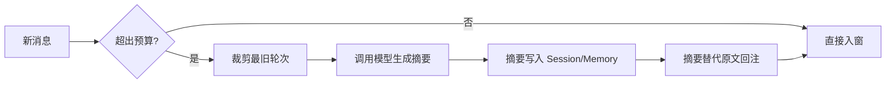

# Context Window 管理

## 是什么
Context Window 管理是在模型上下文长度有硬上限的前提下，对 system、history、tool results 做预算划分与动态裁剪，避免长程 Agent Loop 因溢出而失败或退化。

## 怎么做
**Token 预算分配**（按优先级预留，以 200k 窗口为例）：

| 区块 | 预算占比 | 策略 |
|------|----------|------|
| System prompt | 10% | 固定，极少变动 |
| 当前 Plan/Task | 15% | 完整保留 |
| 工具结果 | 45% | 超阈值截断 |
| 历史对话 | 25% | 可裁剪/摘要 |
| 余量 | 5% | 防溢出 |

**滑动窗口**：保留最近 N 轮，更早的轮次移出窗口。

**中间结果摘要压缩（compaction）**：对移出窗口的内容，用模型生成结构化摘要回写 Memory，后续以摘要形式重新注入，而非丢弃。

**何时触发压缩**：窗口使用率 > 85%、单条工具结果 > 8k token、或轮次超过窗口承载阈值。

## 为什么
不做裁剪与压缩，长任务会在数十轮后触发上下文截断（模型“失忆”）、或被迫重启丢失进度。预算与压缩是长程任务能否跑完的物理前提。

## 常见误区
- 等到真正溢出才裁剪，导致当轮工具调用已丢关键信息。
- 摘要无结构化 schema，回注后模型无法可靠解析。

## 业界实现对照
- LangGraph：用 `memory` + 自定义 reducer 实现消息裁剪与状态压缩（[docs](https://langchain-ai.github.io/langgraph/concepts/low_level/#reducers)）。
- mem0：异步存储并压缩交互记忆，减轻主上下文压力（[docs](https://docs.mem0.ai/)）。

## 延伸阅读
- [上下文工程](/03-context-memory/context-engineering)
- [会话状态与恢复](/03-context-memory/session-state)
- [预算控制](/01-agent-basics/budget-control)
- [长期记忆选型](/03-context-memory/long-term-memory)

---
*最后核实日期：2026-08-26*
