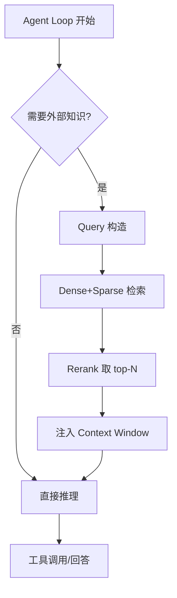

# RAG 检索增强

## 是什么
RAG（Retrieval-Augmented Generation）在 Agent Loop 推理前/中，从外部知识库检索相关片段注入上下文，弥补模型参数化知识的时效性与私有数据缺口。

## 怎么做
**Chunking 策略**：按语义边界切分（标题/段落），重叠 10–15% 防截断；代码按函数/类切，避免跨语法单元。块大小 512–1024 token 兼顾召回与噪声。

**Embedding 选型**：领域强则领域微调模型；通用场景用 `text-embedding-3-large` 或 `bge-m3` 等多语言强模型。需与检索库同维度。

**检索三模式对比**：

| 模式 | 机制 | 优势 | 劣势 |
|------|------|------|------|
| Dense | 向量近邻 | 语义匹配强 | 罕见词/专有名词弱 |
| Sparse | BM25 关键词 | 精确词匹配 | 语义泛化差 |
| Hybrid | 两者融合 | 兼顾 | 需融合权重 |

**Rerank**：召回 top-K（如 20）后用 cross-encoder rerank 取 top-N（如 5）注入，显著降低噪声。

**与 Agent Loop 的集成点**：

建议在“规划阶段”与“工具结果不足时”两个插入点触发检索。

## 为什么
不接 RAG，Agent 面对私有文档、最新规范只能靠幻觉；但无 rerank 的混合检索会把低质块塞进 Context Window，反降准确率并浪费预算。

## 常见误区
- 检索 top-K 直接全量注入，上下文被噪声淹没。
- chunk 按固定字符切，割裂代码/表格语义单元。

## 业界实现对照
- LangChain：`RetrievalQA` + `EnsembleRetriever` 支持 hybrid（[docs](https://python.langchain.com/docs/integrations/retrievers/)）。
- mem0：可作为 RAG 之上的记忆层做去重与更新（[docs](https://docs.mem0.ai/)）。

## 延伸阅读
- [长期记忆选型](/03-context-memory/long-term-memory)
- [Context Window 管理](/03-context-memory/context-window)
- [Agent Loop 基础](/01-agent-basics/agent-loop)
- [上下文工程](/03-context-memory/context-engineering)

---
*最后核实日期：2026-08-26*
