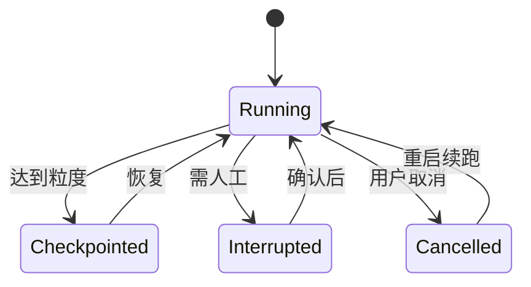

# 会话状态

## 是什么
会话状态管理解决 Agent 在多次运行、多轮对话间“暂停后能接着跑”的问题，核心是 Session store 与 Checkpoint 的设计，使中断、取消、恢复都有确定状态可依据。

## 怎么做
**Session store 设计**：以 `session_id` 为键，持久化 `{messages, plan, tool_call_log, memory_refs, status}`。状态与消息流分离——消息进 Context Window，状态进 store。

**Checkpoint 粒度**按可恢复性权衡：

| 粒度 | 恢复成本 | 适用 |
|------|----------|------|
| 每轮（turn） | 低 | 交互式对话 |
| 每工具调用 | 中 | 长任务、需 Kill Switch |
| 每子计划 | 高 | Plan-and-Execute 大任务 |

**中断/取消语义**：
- 取消（cancel）：终止循环，保留已完成 Checkpoint，状态置 `cancelled`，可重启续跑。
- 中断（interrupt）：人工介入点（如权限确认），保留挂起点，恢复后从 Checkpoint 继续，不全量重跑。

## 为什么
缺乏 Checkpoint，一次崩溃或取消意味着从零重跑整段任务，成本不可接受；缺乏明确的取消语义则无法安全地在长任务中插入人工审批。

## 常见误区
- 把全部状态塞进消息历史，导致恢复时无法区分“已执行”与“待执行”。
- Checkpoint 过粗，恢复需重放大量已完成的工具调用。

## 业界实现对照
- LangGraph：`Checkpointer` 持久化 graph state，支持 `interrupt`/`resume`（[docs](https://langchain-ai.github.io/langgraph/concepts/persistence/)）。
- OpenAI Agents SDK：`Session` 与 `trace` 维护运行状态（[docs](https://openai.github.io/openai-agents-python/)）。

## 延伸阅读
- [Context Window 管理](/03-context-memory/context-window)
- [长期记忆](/03-context-memory/long-term-memory)
- [上下文工程](/03-context-memory/context-engineering)
- [Kill Switch 安全停机](/05-safety-governance/kill-switch)

---
*最后核实日期：2026-08-26*
