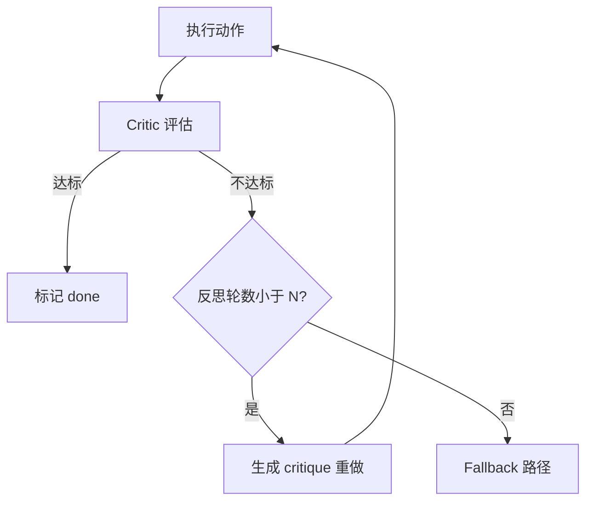

# 错误恢复：重试、反思与降级

## 是什么
错误恢复关注 Agent Loop 在 Tool 调用失败、输出非法或目标未达成时，如何不崩溃、不烧钱地回到可前进状态。

## 怎么做
**重试策略**：对瞬时错误（超时、限流 429）用指数退避；对确定性错误（参数校验失败）直接回模型修正，不重试。

```python
def with_retry(fn, max_attempts=3):
    for i in range(max_attempts):
        try:
            return fn()
        except TransientError as e:
            sleep(backoff(i))  # 1s, 2s, 4s
    raise FallbackRequired(e)
```

**Reflection / Self-critique**：执行后由 Critic 模型评估产出是否达标，未达标则产出 `critique` 并重试，限定反思轮数防止死循环。



**Fallback 路径**：主路径失败时降级——换模型、简化任务、调用人类审批或触发 Kill Switch。降级需与 Budget Control 联动，避免无限消耗。

## 为什么
不做恢复机制时，单次 Tool 失败会中断整条长链，重跑成本极高且不可观测。Reflection 能纠正「看似成功实则错误」的静默失败，比盲目重试更省 Token。但缺乏上限的反思会形成自旋，必须用轮数/预算护栏。

## 常见误区
- 用重试掩盖逻辑错误：对 400/参数错误重试只会重复失败并消耗预算。
- 反思轮数无上限，模型在自洽陷阱里反复修改，触发 Budget Control 截断却无 fallback。

## 业界实现对照
- **LangGraph**：用 `checkpointer` 回滚到失败前状态并重放（https://langchain-ai.github.io/langgraph/）。
- **Claude Agent SDK**：`subagent` 失败可回退主 Agent 处理（https://docs.anthropic.com/en/docs/claude-agent-sdk）。
- **AutoGPT**：早期版本缺乏护栏，常以死循环告终（https://github.com/Significant-Gravitas/AutoGPT）。

## 延伸阅读
- [/04-planning-execution/plan-and-execute](/04-planning-execution/plan-and-execute)
- [/04-planning-execution/todo-management](/04-planning-execution/todo-management)
- [/01-agent-basics/budget-control](/01-agent-basics/budget-control)
- [/05-safety-governance/kill-switch](/05-safety-governance/kill-switch)

---
*最后核实日期：2026-08-26*
