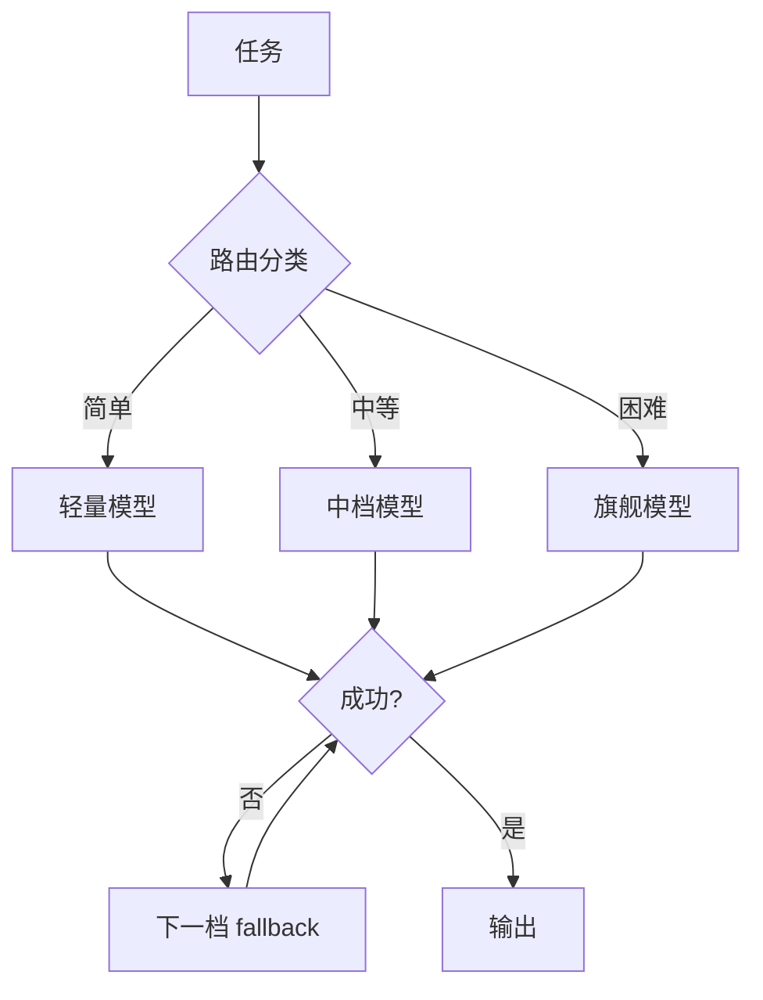

# 模型路由：按复杂度调度模型

## 是什么
模型路由（Model Routing）是根据任务难度、预算与延迟 SLA，把请求动态派发到合适型号（小模型/大模型/专用模型）的调度层，是 Cost-Latency 优化的核心手段。

## 怎么做
**路由决策信号**：任务分类（分类/抽取/生成/推理）、输入长度、用户指定 SLA、历史成本。简单任务走低成本的轻量模型，复杂推理才上旗舰模型。

**成本 / 延迟 / 质量三角权衡**：

| 模型档位 | 单位成本 | 延迟 | 质量（难题） | 适用 |
| --- | --- | --- | --- | --- |
| 轻量模型 | 低 | 低 | 弱 | 分类、抽取、格式化 |
| 中档模型 | 中 | 中 | 中 | 常规生成、RAG 归纳 |
| 旗舰模型 | 高 | 高 | 强 | 多步推理、规划、代码 |

**Fallback 链**：主模型超时/限流/返回非法时，按 `旗舰 → 中档 → 轻量` 或跨供应商降级，保证可用性。

最小实现：`route(task) -> model_id`，调用封装 `with_fallback([m3, m2, m1])`；路由策略可离线由 SWE-bench 类评测标定。

## 为什么
全量使用旗舰模型在高频简单请求上浪费显著成本与延迟；全量用小模型则在难题上质量塌方。路由把预算花在刀刃上。但路由判错（低估难度）会导致质量事故，故 fallback 链必须兜底。

## 常见误区
- 路由只看成本不看质量，简单阈值把推理题误判给小模型，产出不可用结果。
- Fallback 链未跨供应商，主供应商宕机时整条链同时失效。

## 业界实现对照
- **OpenAI Agents SDK**：`Model` 可指定并动态切换（https://openai.github.io/openai-agents-python/）。
- **LangChain**：`RouterChain` 做任务分流（https://python.langchain.com/docs/modules/model_io/）。
- **Claude Agent SDK**：`model` 参数支持运行时选择（https://docs.anthropic.com/en/docs/claude-agent-sdk）。

## 延伸阅读
- [/04-planning-execution/plan-and-execute](/04-planning-execution/plan-and-execute)
- [/06-engineering-ops/cost-latency](/06-engineering-ops/cost-latency)
- [/01-agent-basics/budget-control](/01-agent-basics/budget-control)
- [/06-engineering-ops/evaluation-swebench](/06-engineering-ops/evaluation-swebench)

---
*最后核实日期：2026-08-26*
