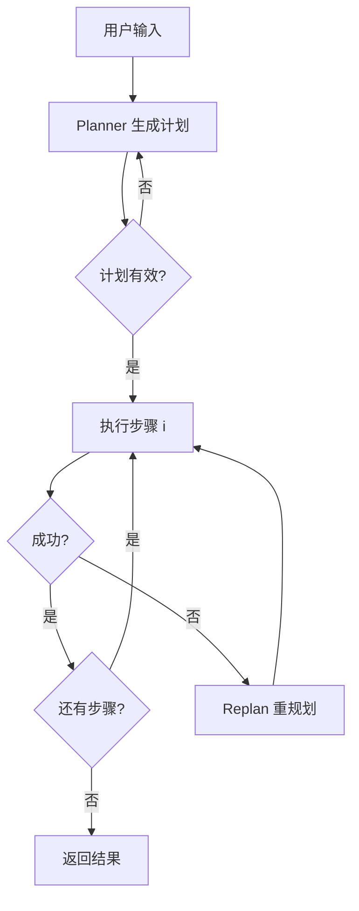

# 规划与执行：ReAct vs Plan-and-Execute

## 是什么
规划与执行解决 Agent 在长程任务中如何分配「何时思考、何时行动」的问题。ReAct 将推理与动作交错在 Agent Loop 中；Plan-and-Execute 则把任务先一次性分解为有序子目标，再逐条执行。

## 怎么做
两种范式的核心差异在「规划发生的时机」与「上下文占用」：

| 维度 | ReAct | Plan-and-Execute |
| --- | --- | --- |
| 规划时机 | 每步实时推理 | 执行前一次性规划 |
| 长程任务稳定性 | 易偏离、累积误差 | 目标明确、可控 |
| Context Window 占用 | 高（思维链随步增长） | 低（计划与执行分离） |
| 动态环境适应 | 强（可随时改路） | 弱（计划固化） |
| 适用任务 | 探索式、交互式检索 | 可分解、目标固定的工程任务 |

**混合模式（推荐）**：先由 Planner 生成结构化计划，Executor 按步执行；当某步失败或环境变化触发重规划。

最小实现：Planner 输出 `Plan{steps: Step[]}`，Executor 循环取 `steps[i]` 调 Tool，把 `observation` 回写步骤状态；失败则带最近 K 步轨迹重新调用 Planner。

## 为什么
纯 ReAct 在超过 10 步的任务上漂移明显——模型在长链中忘记初始目标，且 Context Window 被历史占用迫使截断。纯 Plan-and-Execute 在状态高度不确定的环境（如网页操作）中会因计划失真而整体失败。混合模式用「稳定骨架 + 局部自适应」换取两者的优点。

## 常见误区
- 把计划写得太细（原子级），导致重规划成本高、僵化；计划应到「可验证子目标」粒度。
- Planner 与 Executor 共用同一上下文，重规划时未隔离历史，引发 Prompt Injection 式污染。

## 业界实现对照
- **LangGraph**：用 `Plan-and-Execute` 官方示例，`planner` 与 `executor` 为独立节点（https://langchain-ai.github.io/langgraph/tutorials/plan-and-execute/）。
- **Claude Agent SDK**：支持 `TodoWrite` 式显式规划，配合 Agent Loop 动态执行（https://docs.anthropic.com/en/docs/claude-agent-sdk）。
- **OpenAI Agents SDK**：Handoff 可在子 Agent 间做计划拆分（https://openai.github.io/openai-agents-python/）。

## 延伸阅读
- [/04-planning-execution/todo-management](/04-planning-execution/todo-management)
- [/04-planning-execution/error-recovery](/04-planning-execution/error-recovery)
- [/01-agent-basics/agent-loop](/01-agent-basics/agent-loop)
- [/02-capability-extension/multi-agent](/02-capability-extension/multi-agent)

---
*最后核实日期：2026-08-26*
