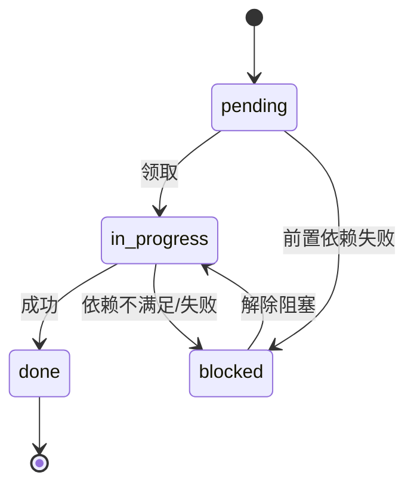

# 任务管理：TodoList 与状态机

## 是什么
TodoList 是 Agent 在执行长程任务时维护的「显式任务账本」，使规划（计划）与执行进度可观测、可恢复，并作为 Context Engineering 的一部分注入给模型。

## 怎么做
**数据结构**（最小可用）：

```python
@dataclass
class Task:
    id: str
    content: str
    status: Literal["pending", "in_progress", "done", "blocked"]
    depends_on: list[str] = field(default_factory=list)
    priority: int = 0
```

**任务状态机**：每步只允许合法迁移，非法迁移（如 `done → in_progress`）应被拒绝并写审计日志。



**动态插入与重排**：执行中发现新子目标时，向列表插入 `Task` 并标记 `depends_on`；重排按 `priority` 与依赖图做拓扑排序后写回顺序。建议每轮执行前用 `update_todo(tasks)` 回写，保证 Checkpoint 可恢复。

## 为什么
没有显式账本时，模型在长链中靠记忆维持进度，极易重复执行已完成步骤或遗漏分支。结构化 TodoList 把进度外置，既降低 Context Window 负担，又让失败恢复（error-recovery）能从中断点续跑而非从头再来。

## 常见误区
- 状态只存内存不自持久化，进程崩溃后丢失全部进度，应随 Checkpoint 落盘。
- 阻塞任务未声明 `depends_on`，导致调度器继续推进其下游而级联失败。

## 业界实现对照
- **Claude Agent SDK**：`TodoWrite`/`TodoRead` 工具原生维护任务列表（https://docs.anthropic.com/en/docs/claude-agent-sdk）。
- **LangGraph**：用 `InjectedState` 持久化 todo 于 Checkpoint（https://langchain-ai.github.io/langgraph/）。
- **OpenAI Agents SDK**：通过 `Task` 概念配合 Handoff 拆分（https://openai.github.io/openai-agents-python/）。

## 延伸阅读
- [/04-planning-execution/plan-and-execute](/04-planning-execution/plan-and-execute)
- [/04-planning-execution/error-recovery](/04-planning-execution/error-recovery)
- [/03-context-memory/session-state](/03-context-memory/session-state)
- [/02-capability-extension/multi-agent](/02-capability-extension/multi-agent)

---
*最后核实日期：2026-08-26*
