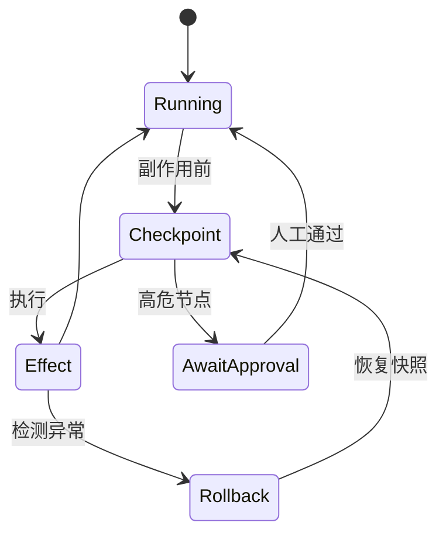

# 审计与回滚

## 是什么
审计（audit）记录 Agent 每一步决策与副作用，回滚（rollback）在出错后将状态恢复到上一个一致 Checkpoint。二者共同构成"事后纠错"能力，区别于运行时的熔断。

## 怎么做
**结构化 trace**：每轮 Agent Loop 落一条 span，字段建议：

```json
{
  "trace_id": "tr_8f2",
  "step": 12,
  "tool": "fs_write",
  "args": {"path": "/etc/nginx.conf"},
  "effect": "modified",
  "prev_snapshot": "snap_7a1"
}
```

**Checkpoint / Snapshot**：在副作用发生前对受影响资源（文件系统、DB 行、消息队列）做快照，回滚即 `restore(snapshot_id)`。

**undo 机制设计**：维护 `(action, inverse_action)` 对，如 `fs_write` 的逆操作是 `restore_bytes`。

**Human-in-the-loop 审批点选择**——优先放在：
- 不可逆操作（删除、对外发送、支付）前；
- 权限边界跨越（低权 Agent 请求高权 Tool）时；
- 置信度低但影响大的分支决策处。



## 为什么
缺少审计，错误无法定位到具体 Tool 调用；缺少 checkpoint，一次错误写操作会污染持久状态且无法收敛，只能人工修复。

## 常见误区
- 只记"最终答案"不记中间 Tool 调用，回滚时无从构造逆操作。
- 审批点过密导致人机交互疲劳，真正高危操作被忽略。

## 业界实现对照
- **Langfuse**：以 OTEL 兼容的 trace 模型记录 observation，支持按 step 回看与评分。
- **LangGraph**：原生 Checkpoint（内存 / Postgres），支持 `revert` 到指定 state。
- 参考：<https://docs.langfuse.com>

## 延伸阅读
- [/06-engineering-ops/observability-otel-langfuse](/06-engineering-ops/observability-otel-langfuse)
- [/05-safety-governance/kill-switch](/05-safety-governance/kill-switch)
- [/05-safety-governance/guardrails](/05-safety-governance/guardrails)

---
*最后核实日期：2026-08-26*
