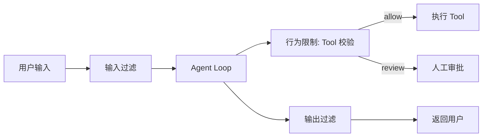

# Guardrails 护栏

## 是什么
Guardrails 是在 Agent Loop 外围设置的可编程约束层，确保内容合规、行为受控。它不依赖模型自觉，而是以规则/分类器强制执行。

## 怎么做
**三类 Guardrails**：

| 类型 | 作用点 | 典型实现 |
| --- | --- | --- |
| 输入过滤 | 进入推理前 | 敏感词、PII、注入关键词扫描 |
| 输出过滤 | 生成回答后 | 泄露检测、毒性分类、格式校验 |
| 行为限制 | Tool 调用前 | 白名单、参数边界、频次配额 |

**高风险操作拦截清单**（命中即阻断或转人工）：

```text
- 文件系统: 写 /etc、~/.*、delete(recursive=true)
- 网络: 外发 HTTP 含凭证头、非白名单域名
- 系统: exec/sh、sudo、kill
- 数据: 批量导出 > N 行、写生产 DB
- 通信: 对外邮件/消息、支付/转账
```

最小实现：在 Orchestrator 调度 Tool 前插入 `guardrail.check(tool, args)`，返回 `allow|deny|review` 三态。



## 为什么
仅凭系统 prompt 要求"不要做 X"不可靠，模型在长上下文或多轮压力下会偏离。Guardrails 把安全从"建议"变成"强制"。

## 常见误区
- 只在输出侧加护栏，忽略 Tool 调用这一真正副作用出口。
- 拦截过宽导致正常任务频繁 `review`，最终被运维绕过。

## 业界实现对照
- **Anthropic 安全文档**：建议将护栏与权限模型结合，对高影响动作强制 review。
- **OpenAI Agents SDK**：提供 `InputGuardrail` / `OutputGuardrail` 钩子，trip 时中断整轮运行。
- 参考：<https://openai.github.io/openai-agents-python/guardrails/>

## 延伸阅读
- [/05-safety-governance/prompt-injection](/05-safety-governance/prompt-injection)
- [/02-capability-extension/permission-sandbox](/02-capability-extension/permission-sandbox)
- [/05-safety-governance/kill-switch](/05-safety-governance/kill-switch)

---
*最后核实日期：2026-08-26*
