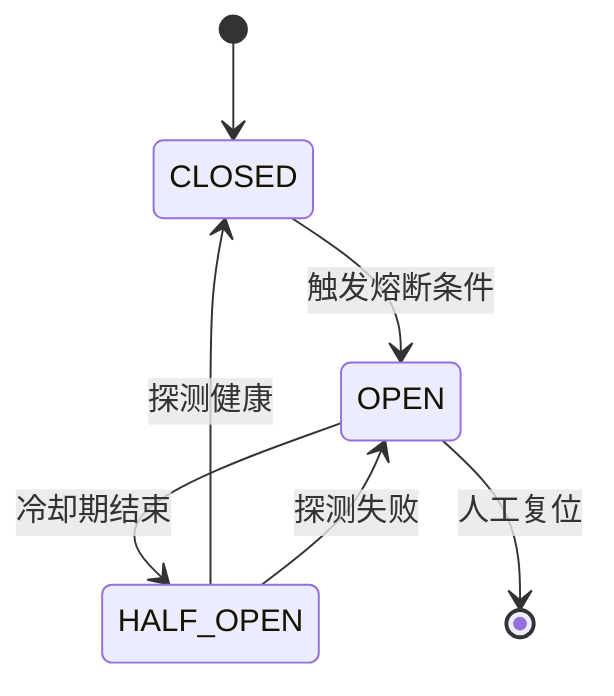

# Kill Switch 熔断

## 是什么
Kill Switch（熔断 / circuit breaker）是运行时机制：在检测到失控、超支或危险信号时，立即中止整个 Agent Loop 或单个 Tool 调用，防止损害扩大。

## 怎么做
**触发信号**：预算超阈值（见 1.4 预算控制）、连续错误率超界、命中 Guardrails 高危清单、人工急停按钮。

**设计要点**：
- 全局开关置于 Orchestrator，信号通过共享状态（如 redis）广播给所有 Worker；
- 熔断后进入 `OPEN` 态，新请求直接拒绝，避免雪崩；
- 提供半开 `HALF_OPEN` 探测，确认恢复后回到 `CLOSED`。

最小实现：Agent Loop 每轮检查 `kill_switch.is_open()`，为真则抛 `AgentHalt` 并清理进行中 Tool。

## 为什么
不做熔断时，受 Prompt Injection 诱导的 Agent 会持续调用付费 Tool 或外发数据，损失随时间线性增长；人工发现前已无法止损。

## Kill Switch vs Rollback

| 维度 | Kill Switch（熔断） | Audit-Rollback（回滚） |
| --- | --- | --- |
| 时机 | 运行时，损害发生中 | 事后，损害已发生 |
| 目标 | 立即止损、阻止扩大 | 恢复到一致状态 |
| 触发 | 阈值/信号/人工 | 异常检测/人工 |
| 可逆性 | 复位即恢复服务 | 需执行逆操作 |
| 依赖 | 全局共享状态 | Checkpoint 快照 |

## 常见误区
- 认为有回滚就不需要熔断：回滚无法阻止进行中的外发或扣费。
- 熔断粒度太粗，单次坏 Tool 拖垮整个系统。

## 业界实现对照
- **LangGraph**：可通过 `interrupt()` 在节点边界暂停，等价于受控熔断点。
- **OpenAI Agents SDK**：`RunResult` 提供 `cancel()` 中止正在进行的 run。
- 参考：<https://docs.anthropic.com/en/docs/agents-and-tools/agent-safety>

## 延伸阅读
- [/05-safety-governance/audit-rollback](/05-safety-governance/audit-rollback)
- [/01-agent-basics/budget-control](/01-agent-basics/budget-control)
- [/05-safety-governance/guardrails](/05-safety-governance/guardrails)

---
*最后核实日期：2026-08-26*
