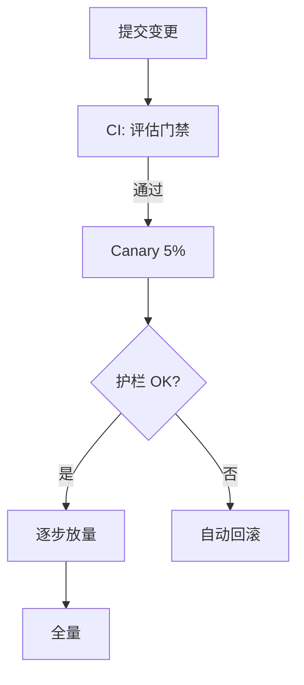

# 部署与弹性伸缩

## 是什么
Agent 是有状态、长程、会调外部 Tool 的服务。本页解决“如何在不共享危险状态、不被单租户拖垮、且可安全回滚的前提下横向扩展 Agent 实例”。

## 怎么做
- **并发模型（实例隔离）**：每个会话/任务跑独立 Agent 实例，状态留在 Checkpoint 而非进程内存；用 Orchestrator-Worker 派发子任务，Worker 间通过消息而非共享变量通信（见 2.4）。
- **多租户资源隔离**：用命名空间 + 配额（并发数、token 预算、Tool 调用额度）隔离租户；危险 Tool 走 Permission Sandbox 单独鉴权（见 2.3）。
- **CI/CD 与灰度**：模型/Prompt/代码变更经评估门禁（见 6.3）后，先 canary 小流量，按错误率与成本护栏（Guardrails）自动放量或回滚。

## 为什么
Agent 实例若共享内存状态，一个租户的 Checkpoint 污染会串到他人；无配额则单租户的失控 Agent Loop 占满 token 预算拖垮全局。隔离 + 灰度把“一次坏变更”的爆炸半径限制在单实例/小流量内。

## 常见误区
- 把长程 Agent 跑成常驻进程却不落 Checkpoint，崩溃即丢失全部进度。
- 灰度只看 QPS，忽略成本漂移——新模型可能更贵却更慢。

## 业界实现对照
- **LangGraph Platform**（带状态的服务化部署，https://langchain-ai.github.io/langgraph/）。
- **OpenAI Agents SDK deployment**（https://openai.github.io/openai-agents-python/）。
- **Kubernetes + KEDA** 基于队列深度的弹性伸缩。

## 延伸阅读
- [/02-capability-extension/permission-sandbox](/02-capability-extension/permission-sandbox)
- [/02-capability-extension/multi-agent](/02-capability-extension/multi-agent)
- [/06-engineering-ops/evaluation-swebench](/06-engineering-ops/evaluation-swebench)
- [/05-safety-governance/kill-switch](/05-safety-governance/kill-switch)

---
*最后核实日期：2026-08-26*
