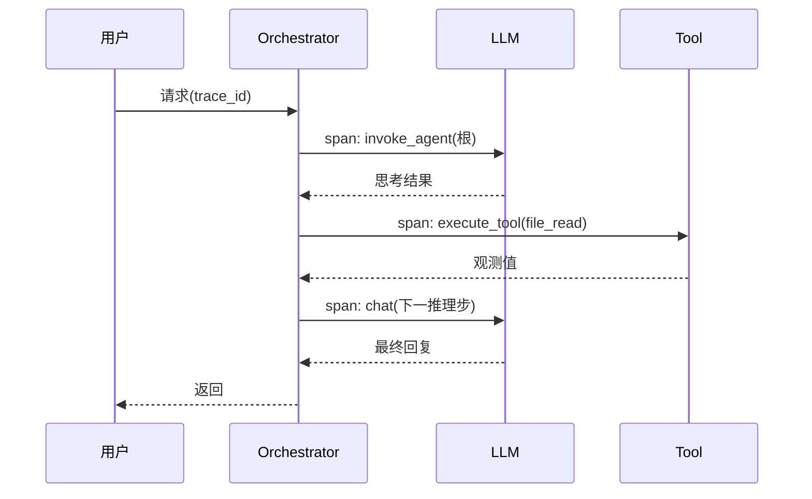

# 可观测性：OTEL 标准化埋点 + Langfuse LLM 可视化

## 是什么
Agent 的非确定性推理-行动链无法靠传统日志定位。本页解决“如何在多步 Agent Loop、Tool 调用、多 Agent 编排下，得到可过滤、可归因、可审计的执行轨迹”。

## 怎么做
**Trace/Span 建模**：一次 Agent run = 一个 trace；每个 LLM 调用、Tool 调用、子 Agent handoff 各为一个 span，通过父子关系构成树。OpenTelemetry 的分层为 Session > Trace > Span > Event。



**OTEL 标准化埋点**：采用 GenAI 语义约定（schema 1.42.0，2026-06 起迁至 `open-telemetry/semantic-conventions-genai`，仍属 Development 阶段）。关键属性：`gen_ai.operation.name`(chat/execute_tool/invoke_agent)、`gen_ai.provider.name`、`gen_ai.request.model`、`gen_ai.usage.input_tokens/output_tokens`、`gen_ai.response.finish_reasons`、`gen_ai.agent.id`。五种核心 span：client、invoke_agent、execute_tool、invoke_workflow、retrieval。注意：`gen_ai.provider.name` 已在 v1.37.0 取代废弃的 `gen_ai.system`；完整 prompt/response 体默认不采集，需 `OTEL_SEMCONV_STABILITY_OPT_IN=gen_ai_latest_experimental` 开启（注意 PII）。

**Langfuse 做 LLM 专属可视化**：Langfuse 以 OTel 为底座，提供层级 trace、Agent 图、Session、成本/延迟看板，并内建 Prompt Management 与 LLM-as-a-judge 评估，把观测直接闭环到回归测试集。

```python
from langfuse import observe
@observe()  # 自动串联嵌套 span，导出为 OTel trace
def handle(text):
    return openai.chat.completions.create(model="gpt-5", messages=[...])
```

## 为什么
自研日志在跨框架、跨厂商时无法关联——不同 Agent、子进程（MCP 调用）的上下文断链，排障靠 grep。OTel 统一语义约定让 Datadog/Grafana/Jaeger/Langfuse 共用同一套 trace 模型，避免厂商锁定，并为成本归因到单个 span。

## 常见误区
- 全量采集 prompt/response 正文，造成 PII 合规风险与存储成本爆炸（AI 负载遥测量是传统服务 10–50×）。
- 忽略 GenAI 约定仍处 Development：直连实验性字段，升级即断裂——应 pin 约定版本。

## 业界实现对照
- **OpenTelemetry GenAI Semantic Conventions**（https://opentelemetry.io/docs/specs/semconv/gen-ai/）。
- **Langfuse**（OTel-native，MIT，可自托管，https://langfuse.com/docs）。
- **OpenTelemetry Collector** GenAI normalizer processor（https://opentelemetry.io/docs/collector/）。

## 延伸阅读
- [/06-engineering-ops/evaluation-swebench](/06-engineering-ops/evaluation-swebench)
- [/06-engineering-ops/cost-latency](/06-engineering-ops/cost-latency)
- [/01-agent-basics/agent-loop](/01-agent-basics/agent-loop)
- [/05-safety-governance/audit-rollback](/05-safety-governance/audit-rollback)

---
*最后核实日期：2026-08-26*
