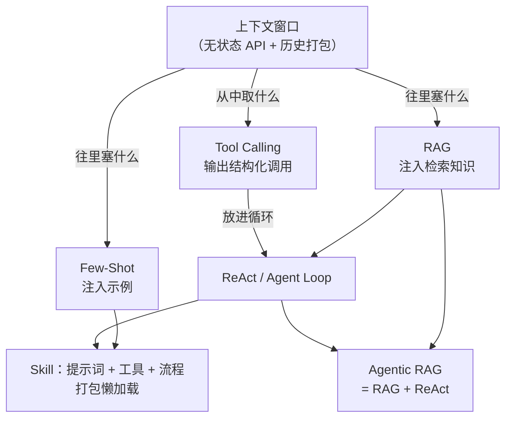

## 写在前面：我「重新发明」过的七个轮子

坦白讲，本站讲的大部分机制，我最初都不是从论文里学来的，而是在调 API 的过程中被逼出来的——先写了能跑的土办法，后来查资料才发现：每一条都有正式的学术名词，而且早已有人做了系统研究。下面按你大概率也会**依次遇到**的顺序，把这七个概念串一遍。它们不是七个并列的名词，而是一条**演化链**：地基是 API 的无状态本质，两端是「往窗口里塞什么」与「从窗口里取什么」，最上层是循环与封装。

### 1. 上下文与记忆 —— 大模型 API 的无状态本质

> **我的独立版本**：第一次做多轮对话，发现模型「失忆」了。打开请求体才看明白：API 完全无状态，所谓「它记得」，其实是客户端每轮把全部历史消息重新打包发一遍。后来才知道，这个朴素事实是所有 LLM 应用的地基。

- **定义**：LLM API 是纯函数——输入 messages 数组，输出下一条消息，不保存任何状态。「记忆」由调用方自己维护、自己打包。
- **核心机制**：把 system / user / assistant / tool 消息按序拼进 Context Window（上下文窗口），构成模型全部的工作记忆；窗口有 token 上限，超限需裁剪或摘要压缩（compaction）。
- **应用场景**：会话持久化、多轮对话、上下文压缩、长期记忆系统——全部源于「历史归你管」这一事实。
- **联系与区别**：它是其余六个概念的**前提**。Few-Shot 与 RAG 管的是往窗口里**塞什么**，Tool Calling 管的是从窗口里**取什么**，其余都是在它之上搭的循环或封装。
- **站内延伸**：[上下文窗口管理](/03-context-memory/context-window)、[状态与会话持久化](/03-context-memory/session-state)

### 2. Few-Shot —— 不动权重，用例子「教」

> **我的独立版本**：想让输出严格符合 JSON，光靠文字描述格式，模型十次错三次。后来直接在 prompt 里贴了两个输入/输出示例，立刻稳定。再后来发现这叫 In-Context Learning——GPT-3 那篇论文的标题就是它。

- **定义**：不更新模型权重，仅在输入中提供 K 个示例（K=0 即 Zero-Shot），模型从示例中归纳任务模式。
- **核心机制**：示例的选择、数量、顺序、摆放位置都显著影响效果；示例本身也消耗 token 预算，需与任务描述权衡。
- **应用场景**：输出格式约束、风格对齐、分类任务冷启动、结构化抽取。
- **联系与区别**：与微调相对——不动权重、即时生效、按 token 付费；与 RAG 同属「往上下文里塞内容」，区别是 Few-Shot 塞的是**人工挑选的示例**，RAG 塞的是**按需检索的知识**。
- **站内延伸**：[上下文工程](/03-context-memory/context-engineering)

### 3. RAG —— 知识在窗口外面

> **我的独立版本**：模型不了解我的私有文档，全塞进去塞不下，于是先切块、每次只把最相关的几块塞进 prompt。后来发现这套流程有名字：Retrieval-Augmented Generation，2020 年的论文。

- **定义**：生成前先检索，把命中的知识注入 prompt，让模型基于给定材料作答。
- **核心机制**：离线：文档 → chunking → embedding → 向量库；在线：query → 检索（dense / sparse / hybrid，可加 rerank）→ 命中文块注入上下文。
- **应用场景**：私有知识问答、长文档问答、需要引用出处的场景。
- **联系与区别**：解决「知识在窗口外」的问题。注意它的检索是**固定流水线**（查一次、生成一次）——这正是它与 Agentic RAG 的分界点。
- **站内延伸**：[RAG 检索增强](/03-context-memory/rag)

### 4. Tool Calling —— 让模型输出「我要调什么」

> **我的独立版本**：想让模型查天气，我让它别直接回答，改输出一段 JSON（函数名 + 参数），外层代码解析并真正执行，再把结果作为 tool 消息喂回去。后来发现这叫 Function Calling（OpenAI，2023），学术源头是 Toolformer。

- **定义**：向模型声明可用工具及其 JSON Schema，模型在回复中输出结构化的调用请求；模型只负责「选择与填参」，**执行永远在应用侧**。
- **核心机制**：工具注册表（name + description + parameters schema）注入上下文 → 模型输出 tool call → 应用执行 → 结果回填消息序列。
- **应用场景**：一切模型需要与外界交互的场景：查数据库、调 API、写文件、发消息。
- **联系与区别**：Few-Shot / RAG 管输入侧，Tool Calling 是**输出侧协议**。它单次即可成立，但要完成多步任务还需要一个循环来承载——那就是 ReAct。
- **站内延伸**：[结构化输出与函数调用](/01-agent-basics/structured-output)、[工具抽象](/01-agent-basics/tool-abstraction)

### 5. ReAct —— 把调用放进循环

> **我的独立版本**：一次 Tool Calling 干不完活，我把它套进 while 循环：模型要么继续调工具，要么宣布「完成」。后来发现这叫 ReAct（2022），是几乎所有 Agent 框架的运行时原型。

- **定义**：Reason + Act——模型交替进行推理（Thought）与行动（Action），观察执行结果（Observation）后继续，直至给出最终答案或触发终止条件。
- **核心机制**：Thought → Action → Observation 滚动循环；工程上必须配套终止条件（max_steps、预算、超时、重复调用检测），否则必然死循环。
- **应用场景**：一切 Agent 系统的运行时骨架——无论框架叫什么名字，内核都是这个循环（Agent Loop）。
- **联系与区别**：Tool Calling 是**一次调用的协议**，ReAct 是**反复调用的骨架**；在循环之上再加规划、任务列表与委派，就演化出 Plan-and-Execute 与多 Agent 编排。
- **站内延伸**：[Agent Loop](/01-agent-basics/agent-loop)、[Plan-and-Execute](/04-planning-execution/plan-and-execute)

### 6. Agentic RAG —— 检索不再是必经步骤，而是工具

> **我的独立版本**：检索一次常常不准，我干脆把「检索」注册成一个工具，让模型自己决定要不要查、用什么关键词查、结果不满意就换 query 再来一轮。后来发现这条路线已经自成流派：Self-RAG、CRAG、Agentic RAG。

- **定义**：把检索器降格为 Agent 可调用的工具之一，检索时机、query 改写、多源合并、结果自评都交给 Agent Loop 决策。
- **核心机制**：朴素 RAG 的固定流水线（检索 → 生成）变为动态决策——可多次检索、可改写 query、可判定「检索结果不足以作答」并补查。
- **应用场景**：多跳问题（答案依赖多个文档链）、研究型问答、跨数据源聚合。
- **联系与区别**：一句话——**Agentic RAG = RAG + ReAct**：知识注入策略（RAG）装进循环骨架（ReAct）。它也是理解「Agentic」一词的最好样本：把固定流水线改造成模型自主决策的工具编排。
- **站内延伸**：[RAG 检索增强](/03-context-memory/rag)、[Agent Loop](/01-agent-basics/agent-loop)

### 7. Skill —— 把「怎么干活」打包成可加载的说明书

> **我的独立版本**：某类任务的系统提示词、工具说明、示例越积越多，全塞 system prompt 窗口装不下。于是拆成一个个独立文件，运行时按任务描述懒加载需要的那几份。后来发现这就是 Agent Skills 的做法，官方管这叫「渐进式披露」（progressive disclosure）。

- **定义**：将提示词、工具说明、参考资料与流程编排打包为独立、可复用、可按需加载的指令包（典型形态：一个带元数据的 Markdown 文件）。
- **核心机制**：运行时先只注入各 Skill 的名字与简介（极低 token 成本），Agent 判断需要时再加载完整内容；解决「能力总量 >> 窗口容量」的矛盾。
- **应用场景**：Agent 能力插件化——代码审查、数据分析、部署运维等各有独立 Skill，互不污染上下文。
- **联系与区别**：Tool 是模型的「手」，Skill 是教模型「怎么用手干这类活」的**说明书**；与 MCP 互补——MCP 解决工具**接入**协议，Skill 解决知识/流程的**封装与复用**。
- **站内延伸**：[Skill 加载与管理](/02-capability-extension/skill-management)、[MCP 加载与扩展](/02-capability-extension/mcp)

### 七个概念，一张图

### 速查表：区别与联系

| 概念 | 解决的问题 | 所在层次 | 一句话联系 |
| --- | --- | --- | --- |
| 上下文 / 记忆 | API 无状态，「记忆」要自己打包 | 地基 | 其余六个概念的前提 |
| Few-Shot | 光靠指令说不清任务 | 输入侧 · 静态 | 往窗口里塞示例 |
| RAG | 知识在窗口外 | 输入侧 · 动态 | 往窗口里塞检索结果 |
| Tool Calling | 模型无法直接作用于外界 | 输出侧 · 协议 | 从窗口里取调用意图 |
| ReAct | 单次调用完不成多步任务 | 运行时 · 循环 | Tool Calling × 循环 |
| Agentic RAG | 固定检索流水线不够聪明 | 组合模式 | RAG + ReAct |
| Skill | 能力总量远超窗口容量 | 封装复用层 | 提示词 / 工具 / 流程打包 |

## 这个站点是什么

本站是一份**工程向**的 AI Agent 设计资料，面向已有分布式系统、算法与基本 ML/LLM 背景的工程师。不解释「什么是 API」「什么是向量」这类基础概念，只聚焦 Agent 领域特有的设计决策与权衡。

全站按「从内到外」的工程分层组织为 6 章、24 个主题页，外加术语表与架构决策矩阵速查页。建议先按章节顺序通读，再用决策矩阵做索引式回顾。

## 内容规范

每个主题页统一采用三段式：

1. **是什么** —— 1–2 句定义问题域，不铺垫。
2. **怎么做** —— 关键技术选择 + 最小可用实现思路，对比用表格、流程用 Mermaid 图。
3. **为什么** —— 不这样做的后果，或与替代方案的权衡。

涉及协议 / 规范 / 基准版本（如 MCP、OTEL + Langfuse、SWE-bench）的页面已 web search 核实当前版本，并在页底标注「最后核实日期」。
