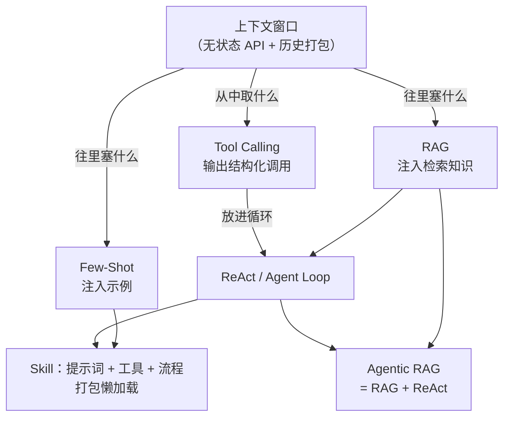

## 我「独立发明」过的七个轮子

坦白讲，下面这些机制，我当年都是凭直觉先自己造了一遍土办法，后来查了查资料才发现——原来它们早就有高大上的名字。先上一张总表，正文再逐个展开。

| 我的土办法（当时是这么想的） | 后来才知道，这叫 |
| --- | --- |
| 大模型（API）其实是个无状态的东西。它所谓的记忆，就是在你每次提问时，把在此之前你和它的所有对话一股脑打包发给它 | **上下文 / 记忆**（无状态 API + 历史打包） |
| 在提示词里给大模型举几个例子 | **Few-Shot**（In-Context Learning） |
| 搜点参考文献，让大模型在回答前看看 | **RAG**（Retrieval-Augmented Generation） |
| 让大模型按格式输出一段 JSON 文本，后端解析这段 JSON，运行大模型希望运行的工具函数 | **Tool Calling**（Function Calling） |
| 让大模型先思考需求，再调用工具，再观察工具调用结果，如此循环往复，直到它觉得自己能回答问题 | **ReAct**（Reason + Act） |
| 让大模型通过 Tool Calling 直接调用搜索函数，自己决定自己想搜什么 | **Agentic RAG** |
| 一段 system prompt，但是只给大模型看个摘要，让大模型想读再读 | **Skill**（渐进式披露） |

下面按「从地基到封装」的顺序逐个展开——它们不是七个并列的名词，而是一条演化链。

### 1. 上下文 / 记忆 —— 大模型 API 是无状态的

> **我的独立版本**：其实大模型（API）是个无状态的东西，它所谓的记忆，就是在你每次提问的时候，把在此之前你和它的所有对话，一股脑打包发给它。

- **是什么**：API 就是个纯函数——塞进去一个 messages 数组，吐出来一条回复，什么也不保存。「记得你」是客户端的功劳，不是它的。
- **核心机制**：每轮把 system / user / assistant / tool 消息按序全量重发；这个包的容量上限就是 Context Window，装不下就得裁剪或者做摘要。
- **应用场景**：多轮对话、会话持久化、长期记忆系统——本质都是你在替模型管历史。
- **联系与区别**：这是其余六个概念的地基——Few-Shot 和 RAG 研究往这个包里**塞什么**，Tool Calling 研究从包里**掏什么**出来。
- **站内延伸**：[上下文窗口管理](/03-context-memory/context-window)、[状态与会话持久化](/03-context-memory/session-state)

### 2. Few-Shot —— 在提示词里举几个例子

> **我的独立版本**：在提示词里给大模型举几个例子。（就这么简单。后来发现这叫 In-Context Learning，GPT-3 那篇论文的标题就是它。）

- **是什么**：不动权重，直接在 prompt 里放 K 个输入/输出示例，模型照葫芦画瓢（K=0 就是 Zero-Shot）。
- **核心机制**：例子选得好不好、放几个、放前面还是后面，效果差很多；例子本身也要吃 token 预算。
- **应用场景**：让输出守格式、对齐风格、分类任务冷启动、结构化抽取。
- **联系与区别**：跟微调相对——不动权重、即改即生效、按 token 付钱；跟 RAG 是一路的（都是往上下文里塞东西），只是塞的是**人挑的例子**，不是检索出来的知识。
- **站内延伸**：[上下文工程](/03-context-memory/context-engineering)

### 3. RAG —— 搜点参考文献，回答前先看看

> **我的独立版本**：搜点参考文献，让大模型在回答前看看。

- **是什么**：先检索再生成——把命中的材料塞进 prompt，让模型「开卷考试」。
- **核心机制**：离线：文档切块、做 embedding、进向量库；在线：用 query 检索最相关的几块，塞进上下文。
- **应用场景**：私有知识问答、长文档问答、需要给出处的场景。
- **联系与区别**：解决「知识在窗口外面」的问题。注意它的检索是**固定流水线**——查一次、答一次，这正是它和 Agentic RAG 的分界线。
- **站内延伸**：[RAG 检索增强](/03-context-memory/rag)

### 4. Tool Calling —— 让模型输出 JSON，后端照着执行

> **我的独立版本**：让大模型按格式输出一段 JSON 文本，然后后端解析这段 JSON 文本，运行大模型希望运行的工具函数。

- **是什么**：给模型一份工具清单（名字 + 说明 + 参数的 JSON Schema），模型回答时不说话，改输出「我要调这个函数、参数是这些」；真正执行永远在你的后端。
- **核心机制**：工具注册表注入上下文 → 模型输出 tool call → 你的代码解析并执行 → 结果作为 tool 消息喂回去。
- **应用场景**：查数据库、调 API、写文件、发消息——一切模型需要「动手」的场景。
- **联系与区别**：Few-Shot / RAG 管输入侧，这个管**输出侧**。单次调用就能成立，但要干多步的活，得有人把它放进循环——那就轮到 ReAct 了。
- **站内延伸**：[结构化输出与函数调用](/01-agent-basics/structured-output)、[工具抽象](/01-agent-basics/tool-abstraction)

### 5. ReAct —— 思考、行动、观察，循环往复

> **我的独立版本**：让大模型先思考需求，再调用工具，再观察工具调用结果，如此循环往复，直到它觉得自己能回答问题。

- **是什么**：Reason + Act——模型在「想（Thought）→ 做（Action）→ 看（Observation）」之间循环，直到它认为能给出最终答案。
- **核心机制**：循环 + 终止条件。工程上必须配 max_steps、预算、超时、重复调用检测，不然就是死循环制造机。
- **应用场景**：一切 Agent 框架的运行时内核——无论框架叫什么名字，都逃不出这个循环（Agent Loop）。
- **联系与区别**：Tool Calling 是**一次调用的协议**，ReAct 是**反复调用的骨架**；再往上加规划、任务列表、委派，就是 Plan-and-Execute 和多 Agent 编排。
- **站内延伸**：[Agent Loop](/01-agent-basics/agent-loop)、[Plan-and-Execute](/04-planning-execution/plan-and-execute)

### 6. Agentic RAG —— 搜索变成模型自己的工具

> **我的独立版本**：让大模型通过 Tool Calling 直接调用搜索函数，自己决定自己想搜什么。

- **是什么**：把「搜索」降格为 Agent 的一个普通工具——什么时候搜、搜什么、搜完不够再搜什么，全由模型自己决定。
- **核心机制**：朴素 RAG 的固定流水线（查一次 → 答一次）升级为动态决策：可多次检索、可改写 query、可判定「材料不够」继续补查。
- **应用场景**：多跳问题（答案散落在多个文档里）、研究型问答、跨数据源聚合。
- **联系与区别**：一句话——**Agentic RAG = RAG + ReAct**：知识注入策略装进循环骨架。
- **站内延伸**：[RAG 检索增强](/03-context-memory/rag)、[Agent Loop](/01-agent-basics/agent-loop)

### 7. Skill —— 一段 system prompt，先看摘要，想读再读

> **我的独立版本**：一段 system prompt，但是只给大模型看个摘要，让大模型想读再读。

- **是什么**：把某类任务的提示词、工具说明、参考资料打包成一个独立文件，平时只露一个摘要，模型觉得需要时才加载全文。
- **核心机制**：先只注入名字 + 简介（几个 token），按需再展开——官方管这叫「渐进式披露」（progressive disclosure）。解决「能力太多、窗口太小」的矛盾。
- **应用场景**：Agent 能力插件化——代码审查、数据分析各有各的 Skill，互不污染上下文。
- **联系与区别**：Tool 是模型的「手」，Skill 是教它「怎么用手干这类活」的说明书；和 MCP 互补——MCP 管工具**接入**协议，Skill 管知识/流程的**封装复用**。
- **站内延伸**：[Skill 加载与管理](/02-capability-extension/skill-management)、[MCP 加载与扩展](/02-capability-extension/mcp)

### 七个概念，一张图

### 速查表：区别与联系

| 概念 | 解决的问题 | 所在层次 | 一句话联系 |
| --- | --- | --- | --- |
| 上下文 / 记忆 | API 无状态，「记忆」要自己打包 | 地基 | 其余六个概念的前提 |
| Few-Shot | 光靠指令说不清任务 | 输入侧 · 静态 | 往窗口里塞示例 |
| RAG | 知识在窗口外 | 输入侧 · 动态 | 往窗口里塞检索结果 |
| Tool Calling | 模型无法直接作用于外界 | 输出侧 · 协议 | 从窗口里取调用意图 |
| ReAct | 单次调用完不成多步任务 | 运行时 · 循环 | Tool Calling × 循环 |
| Agentic RAG | 固定检索流水线不够聪明 | 组合模式 | RAG + ReAct |
| Skill | 能力总量远超窗口容量 | 封装复用层 | 提示词 / 工具 / 流程打包 |

## 这个站点是什么

本站是一份**工程向**的 AI Agent 设计资料，面向已有分布式系统、算法与基本 ML/LLM 背景的工程师。不解释「什么是 API」「什么是向量」这类基础概念，只聚焦 Agent 领域特有的设计决策与权衡。

全站按「从内到外」的工程分层组织为 6 章、24 个主题页，外加术语表与架构决策矩阵速查页。建议先按章节顺序通读，再用决策矩阵做索引式回顾。

## 内容规范

每个主题页统一采用三段式：

1. **是什么** —— 1–2 句定义问题域，不铺垫。
2. **怎么做** —— 关键技术选择 + 最小可用实现思路，对比用表格、流程用 Mermaid 图。
3. **为什么** —— 不这样做的后果，或与替代方案的权衡。

涉及协议 / 规范 / 基准版本（如 MCP、OTEL + Langfuse、SWE-bench）的页面已 web search 核实当前版本，并在页底标注「最后核实日期」。
